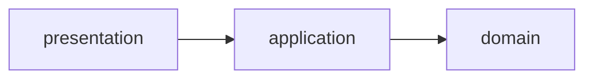

# Employee Management System
## Design of Application Architecture
This repository adopt a concentric circles of Clean Architecture to simplify dependencies.

Also gather configuration classes on `config` package.

## How to use this spring-boot project

- Install packages with `mvn package`
- Run `mvn spring-boot:run` for starting the application (or use your IDE)

Application (with the embedded H2 database) is ready to be used ! You can access the url below for testing it :

- Swagger UI : http://localhost:8080/swagger-ui.html
- H2 UI : http://localhost:8080/h2-console

> Don't forget to set the `JDBC URL` value as `jdbc:h2:mem:testdb` for H2 UI.

<!--
### Instructions

- download the zip file of this project
- create a repository in your own github named 'java-challenge'
- clone your repository in a folder on your machine
- extract the zip file in this folder
- commit and push

- Enhance the code in any ways you can see, you are free! Some possibilities:
  - Add tests
  - Change syntax
  - Protect controller end points
  - Add caching logic for database calls
  - Improve doc and comments
  - Fix any bug you might find
- Edit readme.md and add any comments. It can be about what you did, what you would have done if you had more time, etc.
- Send us the link of your repository.

#### Restrictions
- use java 8

#### What we will look for
- Readability of your code
- Documentation
- Comments in your code 
- Appropriate usage of spring boot
- Appropriate usage of packages
- Is the application running as expected
- No performance issues

-->

## Note for ALJ
### My experience in Java
- I know Spring Boot well and have been using it over 5 years

### What I did
- Documentation (on this `readme.md`)
- Changed package structure (described the above)
- Add `Employee` model and rename the entity to `EmployeeEntity`
  - Entities of data models for DB relations should not be shown on the interface
    - We should conceal them from the system clients and use domain models instead of ORM entities
  - To avoid updating IDs of existing `EMPLOYEE` records
- Implemented and modified APIs and logic
- Implemented tests
- Removed `BasicErrorController` view from Swagger UI

### What I would have done if I had more time
This list is ordered by priority that I think.

- Add spring profiles and `application-{env}.properties` files for production-ready
  - Use external DB instead of embedded H2 and change the endpoints depending on running environment
- Modify `EmployeeControllerTest` to use **MockMvc** instead of directly execution of methods
- Modify `DELETE` method from physical deletion to logical deletion
  - Create `DELETED_EMPLOYEE` table and move deleted data to this table (not using deletion flag)
- Create `DEPARTMENT` table and make relationship between `EMPLOYEE` and `DEPARTMENT`
  - Add `departmend_id` field on `EmployeeEntity` instead of the name of `department`
  - Use `@ManyToOne` annotation on `department_id` of `EmployeeEntity` and join fetch on `EmployeeRepository` to avoid N+1 problem
- Protect controller end points
  - Add simple authentication/authorization functions using Spring Security
- Adopt CQRS for complex requirements
  - Add `query` package to separate data models
    - Data models for commands are entities
    - Data models for queries are so-called DTO
  - Can adopt other ORMs (such as MyBatis, Doma, etc.) for commands and queries
- Add caching logic for database calls
  - Use memory based cache service (such as Redis, Memcached, etc.) and Spring Cache
    - I have previously made a [sample repository](https://github.com/tobachi/sandbox-spring-cache) using Redis and Spring Cache 
